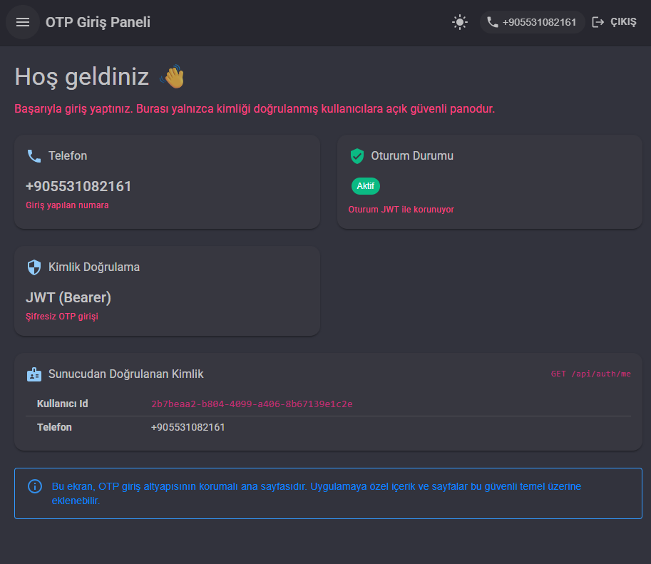

<div align="center">

# 🔐 OtpAuth — Şifresiz SMS (OTP) Giriş Sistemi

**Passwordless SMS authentication built with .NET 9 & Blazor WebAssembly**

Telefon numarası + tek kullanımlık 6 haneli kod ile parolasız giriş.
Clean Architecture, JWT, EF Core ve değiştirilebilir SMS sağlayıcı entegrasyonu.


</div>

---

## 📖 Genel Bakış

OtpAuth, kullanıcıların **parola yerine** telefonlarına gelen tek kullanımlık kod (OTP) ile giriş yaptığı, uçtan uca bir kimlik doğrulama uygulamasıdır. SMS gönderimi soyutlanmış bir arayüz üzerinden yapılır; bu sayede **sağlayıcı değiştirmek tek bir sınıfı düzenlemek kadar kolaydır** (referans entegrasyon: ÖzTek Haberleşme).

## 📸 Ekran Görüntüleri

<div align="center">

| Giriş — OTP kod doğrulama | Korumalı Dashboard |
|:--:|:--:|
|  |  |

</div>

## ✨ Özellikler

- 📱 **Şifresiz OTP girişi** — telefon + 6 haneli kod akışı
- 🔑 **JWT tabanlı oturum** — stateless, `localStorage`'da saklanır, 401'de otomatik logout
- 🧅 **Clean / Onion mimari** — Domain · Application · Infrastructure · API · Client
- 🔌 **Değiştirilebilir SMS sağlayıcı** — `ISmsSender` arayüzü; ÖzTek entegrasyonu hazır
- 🛡️ **Güvenlik** — kriptografik kod üretimi, deneme limiti, tek aktif kod, numara sızıntısı önleme
- 🎨 **Modern arayüz** — MudBlazor, responsive, Dark/Light
- 🧪 **Birim testleri** — xUnit ile SMS entegrasyon mantığı doğrulanmış
- 🚀 **Tek tıkla çalıştırma** — `baslat.ps1` ile API + Client birlikte başlar

## 🛠️ Teknolojiler

`C#` · `.NET 9` · `Blazor WebAssembly` · `ASP.NET Core Web API` · `Microsoft Identity` · `JWT Bearer` · `Entity Framework Core` · `MSSQL` · `MudBlazor` · `xUnit`

---

## 🏛️ Mimari

```
OtpAuth.sln
├── src/
│   ├── OtpAuth.Domain          → Entity'ler (OtpCode). Dış bağımlılık yok.
│   ├── OtpAuth.Application      → Soyutlamalar (ISmsSender, IJwtTokenGenerator, IAuthService), DTO'lar, Result.
│   ├── OtpAuth.Infrastructure   → EF Core DbContext, Identity, JWT üretimi, AuthService, SMS gönderici (ÖzTek).
│   ├── OtpAuth.Api              → .NET 9 Web API (AuthController), JWT auth, CORS, Swagger.
│   └── OtpAuth.Client           → Blazor WASM + MudBlazor, layout'lar, AuthState yönetimi.
└── tests/
    └── OtpAuth.Tests            → xUnit birim testleri (SmsSender).
```

Bağımlılık yönü (içe doğru): `Api → Infrastructure → Application → Domain`

## 🔄 Giriş Akışı

```
Kullanıcı telefonu girer
        │  POST /api/auth/request-otp
        ▼
Sunucu kriptografik 6 haneli kod üretir → MSSQL'e yazar → SMS ile gönderir
        │
        ▼
Kullanıcı kodu girer
        │  POST /api/auth/verify-otp
        ▼
Kod doğruysa → JWT üretilir → Client localStorage'a yazar → oturum açılır → korumalı sayfa
```

## 🌐 API Uçları

| Method | Yol | Koruma | Açıklama |
|---|---|---|---|
| `POST` | `/api/auth/request-otp` | Açık | Telefon için OTP üretir + SMS gönderir |
| `POST` | `/api/auth/verify-otp` | Açık | Kodu doğrular, JWT döner |
| `GET`  | `/api/auth/me` | 🔒 JWT | Token'daki kimliği döner (koruma örneği) |

---

## 🚀 Hızlı Başlangıç

### Gereksinimler
- [.NET 9 SDK](https://dotnet.microsoft.com/download/dotnet/9.0)
- MSSQL (SQL Server Express veya LocalDB)

### 1. Veritabanı bağlantısı
`src/OtpAuth.Api/appsettings.json` → `ConnectionStrings:DefaultConnection` değerini ortamına göre ayarla:
```
Server=.\SQLEXPRESS;Database=OtpAuthDb;Trusted_Connection=True;TrustServerCertificate=True;MultipleActiveResultSets=true
```

### 2. Veritabanını oluştur (migration hazır)
```powershell
dotnet tool install --global dotnet-ef   # bir kez
dotnet ef database update --project src/OtpAuth.Infrastructure --startup-project src/OtpAuth.Api
```

### 3. Çalıştır

**En kolay yol — tek tıkla** (API + Client birlikte):
```powershell
.\baslat.ps1
```

**veya iki ayrı terminal:**
```powershell
dotnet run --project src/OtpAuth.Api      # https://localhost:7100 (Swagger: /swagger)
dotnet run --project src/OtpAuth.Client   # https://localhost:7200
```

Tarayıcı: **`https://localhost:7200`** → otomatik `/login` sayfasına yönlenir.

> 💡 **SMS olmadan test:** `appsettings.json → Sms:Enabled = false` iken kod gerçek SMS yerine
> **API konsoluna** yazılır (`OTP üretildi => +90... : 123456`). Akış uçtan uca SMS hesabı olmadan denenebilir.

---

## 📨 SMS Entegrasyonu (ÖzTek)

SMS gönderimi `ISmsSender` arayüzü üzerinden soyutlanmıştır; referans implementasyon **ÖzTek Haberleşme** API'sidir (`src/OtpAuth.Infrastructure/Sms/SmsSender.cs`). Canlıya almak için yalnızca hesap bilgilerini gir:

```json
"Sms": {
  "Enabled": true,
  "BaseUrl": "http://www.ozteksms.com/panel/smsgonder1Npost.php",
  "Kno": "<kullanıcı kodu>",
  "Kulad": "<kullanıcı adı>",
  "Sifre": "<şifre>",
  "Gonderen": "<onaylı originatör>",
  "Tur": "Normal"
}
```

> Başka bir sağlayıcıya geçmek için yalnızca `SmsSender` sınıfını değiştirmek yeterlidir; OTP/JWT akışı etkilenmez.

## 🧪 Testler

```powershell
dotnet test
```
SMS entegrasyonu, gerçek ağ/kimlik bilgisi olmadan sahte HTTP handler ile doğrulanır
(numara dönüşümü, XML kurulumu, başarı/hata yanıtları, devre dışı modu, XML escape).

---

## 🔒 Güvenlik Notları

- **Kriptografik kod üretimi** — `RandomNumberGenerator` ile tahmin edilemez 6 haneli kod
- **Enumeration koruması** — `request-otp` yanıtı numaranın kayıtlı olup olmadığını sızdırmaz
- **Brute-force koruması** — `MaxAttempts` aşılınca kod geçersiz kılınır
- **Tek aktif kod** — yeni kod istenince önceki kodlar iptal edilir
- **CORS** — geliştirmede localhost serbest, production'da yapılandırılmış origin'lere kilitli

**Production öncesi:** `Jwt:SigningKey` ve SMS bilgilerini **User Secrets / ortam değişkeni / Key Vault**'a taşı (repoya gizli bilgi koyma).

---

<div align="center">

Detaylı kurulum için **[KURULUM.md](KURULUM.md)** dosyasına bakın.

</div>
